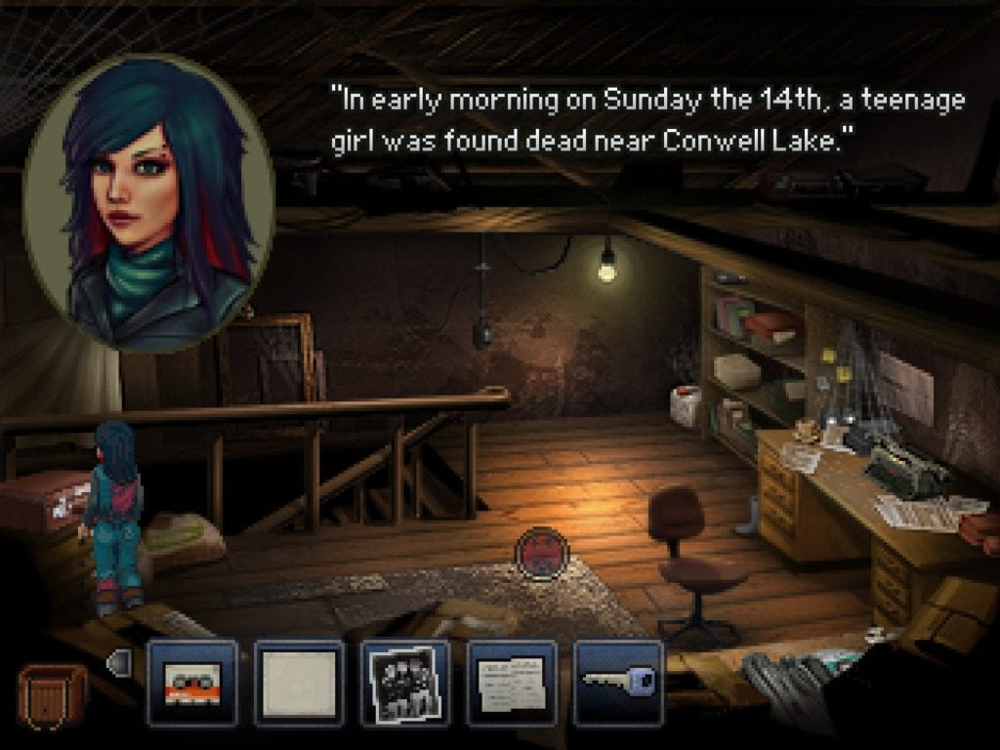
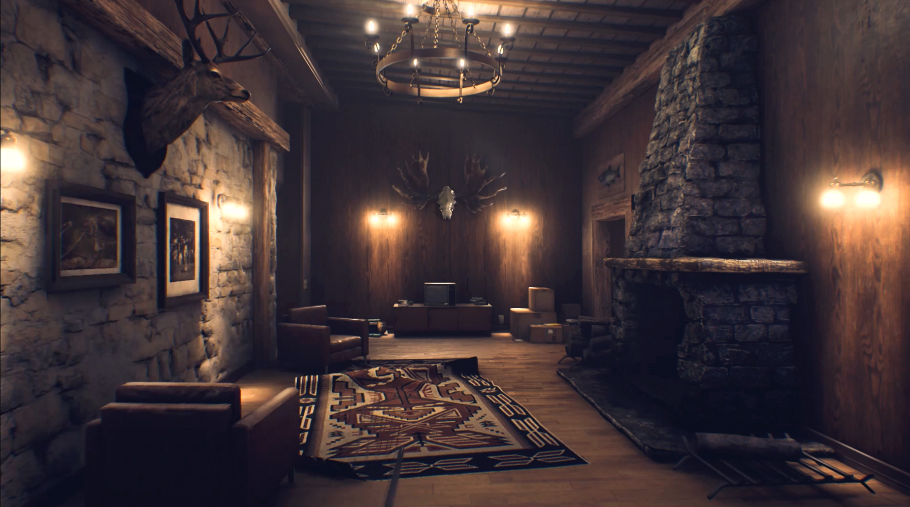
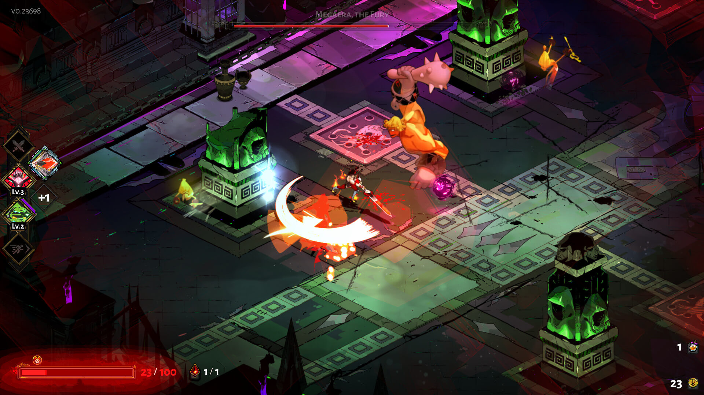
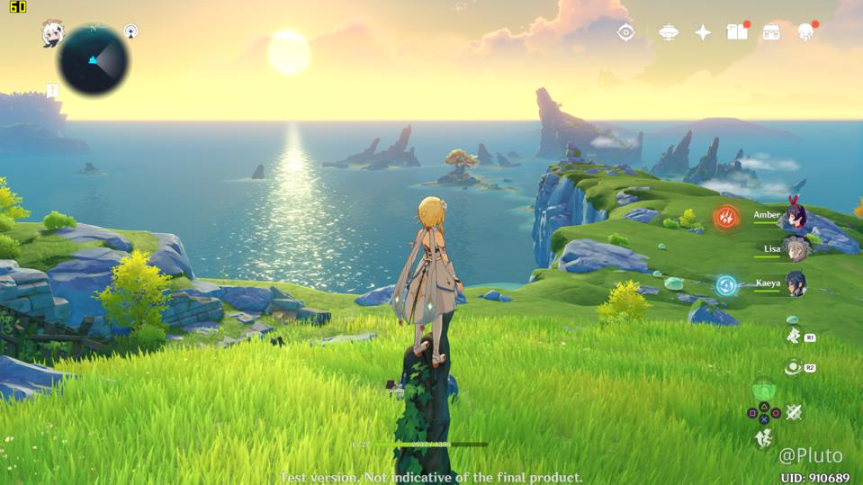

# Dan's Top 10 Games 2020

## 10. Kathy Rain

I'm still currently playing through this one but think it's fair to put it on this list. It's got that charming nostalgia factor of the adventure games of old. There's some light puzzles in it which haven't proved anything too difficult but the odd time I've resulted to a google out of lack of patience rather than anything to blame the game on. The plot is based around the protag as a journalism student investigating the death of her recently deceased grandfather - during which weird things crop up. It gave me some vibes of the blackwell series but minus the ghosts. I think it's one worth checking out if your looking for a Point & Click adventure you haven't tried out yet.

## 9. They Are Billions

This fucking game. I hope to play more of it this month, but it's by far the hardest RTS game I've come up against. The difficulty or rather the learning curve is super harsh. I've completed about 3 missions of the campaign and barely at that. The game is super punishing in that the tech tree is locked behind a currency you obtain from completing missions - this means in between missions you can decide to unlock the next tier of soldier or structure or tech knowledgy. So far this sounds fair... BUT here is the thing I really dislike about this. The game records the number of times you lose a mission, reducing the total possible rewarded currency you can get from a mission. So it's possible to lose a mission X times and end up completing it only to come away with... I'm guessing... close to nothing. This HEAVILY disincentivizes you to lose which is an interesting concept for a rogue-like-esque RTS style of play but when you're coming to it for the first time it's a lot to take into consideration and try to figure out. It's fun but man, it's fucking difficult.

## 8. The Vagrant

This game caught me off guard. I expected it to be just another boring side scrolling game but it has it's own unique charm. For whatever reason it's reminiscent of Dust: An Elysian Tale. There is a skill tree you can progress through and some mechanics around your in-game combat system/special abilities that make the combat in my opinion slightly above average for this style of game. There's also some rune systems that enable you to upgrade your weapons along the way with passive bonuses which is interesting but not really fleshed out in a meaningful way that I've seen yet. The plot isn't anything special but there is still something very satisfying to the gameplay that makes up for that fact. It's a good mindless go in hack and slash the shit out of some enemies then call it a night.

## 7. Othercide

In three words: Lovecraftian Rogue-like X-Com. Turn based strategy game set in a harrowing black/white and red art style. The game itself is very run based and set on a mission selection style format, the unique aspect of this being you can resurrect previously fallen characters which adds a level of strategy to your gameplay. Some runs you may opt to just power up a character so you can level them up and revive them in future runs. Other runs you will be focused on exploiting the weaknesses of certain bosses/opponents that are currently causing you problems. There's a bunch of perma unlocks you get along the way that make subsequent runs easier. The fighting mechanics are interesting in that it plays on this initiative timeline that you can exploit to your advantage, doing extra abilities in a turn may get you out of a bind but paralyze you for a full turn. Generally speaking your party is limited to a maximum of three per mission, so you need to select carefully based on your characters strengths/weaknesses. I'm surprised I haven't seen more of this game in the press, I think it's a very solid turn based strategy game - that I've yet to progress too far in it.

## 6. The Suicide of Rachel Foster

This game falls very much under the walking simulator style of game - very reminiscent in parts to the likes of Firewatch. The game has a very interesting story to tell and sets the atmosphere excellently, it had me jumping out of my chair during certain parts - the audio is absolutely phenomenal with headphones and super immersive. It deals with the subject material very tastefully while at the same time portraying quite an intense story. I'm also a sucker for narrative games that allow for multiple endings. Definitely recommend if you're looking for a new Gone Home/Firewatch type game.

## 5. Among Us

I've played a bunch of this in chat rooms with some people I know as well as solo in public lobbies, there is definitely something unique about this for a co-op multiplayer experience. The key premise being there are two imposters amongst your team that you need to vote out before they kill you and your fellow crewmates. Rounds are mostly a combination of minigames that when all crewmates complete you win, however more often than not imposters will kill your fellow crewmates before you can get all tasks completed. The real magic to this game comes to voting rounds, players can either manually call an emergency meeting at certain intervals, or alternatively you can call a meeting by reporting a dead bound you have found. During these voting rounds everyone needs to decide who they want to vote to eject from the ship - and therein the chaos lies. It's a perfect demonstration of how the Jury system doesn't work - and how little evidence can be required to convince people to vote off innocent crewmates during a game. This game shines brightest when played on stream in front of an audience watching the chaos unfold. I've had lots of hilarious moments playing this and I'm looking forward to seeing what the dev's plan to do next with it. Also hilarious to note AOC was playing this during the year - bizzare.

## 4. Control (Ultimate Edition)

I only got around to playing this game this December alongside it's DLCs "The Foundation" and "AWE". As an entire package it blew me away by the end - I was expecting a short 10 hour experience and got way more than I bargained for. I think this was a VERY impressive third person shooter (controller is a must) with interesting narrative hooks, it's one of a few games that I took time to read through the collectibles to get a better idea of what was happening in the game's narrative. I felt the early hours were lacking in terms of gameplay but come the mid-late game having unlocked multiple weapons/abilities it opened up a lot of variety and enabled a nice feel of progression towards the story and general character progression. The visual style to the game is very striking and the way it narrates the plot through in-game videos and conversations with characters is definitely noteworthy for other game devs.

## 3. Hades

I've loved both Bastion & Transistor so it was no surprise that I also loved Hades. I was a little hesitant going in due to the rogue-like nature of the games mechanics but they integrated the story aspects seamlessly into the games format which added a compelling driving force for repeating runs and constantly pushing forward through the pain; it made for something special. I have still yet to beat Hades but I've come close on many occasions. I still plug in and bash away at it in short 30minute or so bursts - a gorgeous looking game with some beautiful artistry that elegantly represents the Greek Gods. Definitely hope they do more with the universe/setting.

## 2. Genshin Impact

There's no other way to look at this game than being a better, bigger and cheaper/free version of a well built Zelda game. It's basically breadth of the wild on steroids with the added option of micro transactions. I tend to use this as more of a podcast/netflix game paying little attention to the story but enjoying grinding out mobs or doing many of the open world puzzles available to you. Thoroughly enjoyable, playing it with originally Japanese voices with subtitles. It's difficult to not recommend trying it for an hour or two to see if you enjoy it. The game doesn't take itself too seriously and is clearly built for that returning gaming experience. There are some moral implications around the gambling/lootbox free to play hooks they have in it but honestly I haven't paid a cent yet and I'm still nowhere near to touching all the content. It's hard to not give this game praise.

## 1. Command & Conquer Remastered Collection

A truly fantastic remaster of the original Tiberian Dawn & Red Alert games at a dirt cheap price of €25. They did an outstanding job of the audio and control remastering and added fantastic graphical overhauls while also keeping a graphics toggle option available for the full nostalgic feel. The online multiplayer aspects of the game were great to get involved with - its a very small community which made it something special. I was able to partake in a few tournaments this year and also host a couple myself which was pretty special! (also got to make several connections out in the eSports world which is kinda rad). The dev support for it was cut off a couple months ago and sadly the online state of the game is now dead but all-in-all for the buy in price it was a hell of a bargain and thus earns #1 on my list this year!

## Other Awards

###Best Soundtrack
Command & Conquer Remastered Collection  
###Best Character
Chaos - Hades
### Best Style
Hades  
### Best Multiplayer
Among Us  
### Biggest Surprise
Genshin Impact
