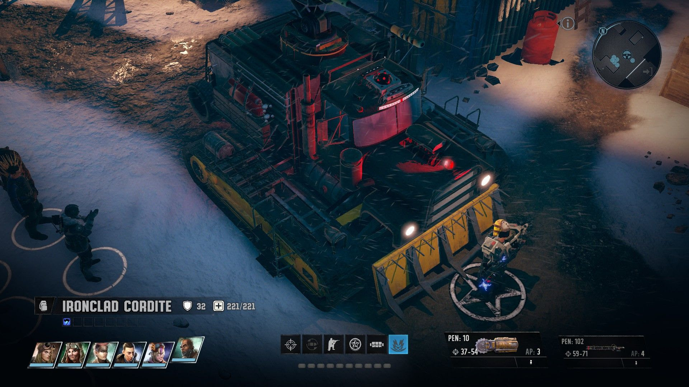
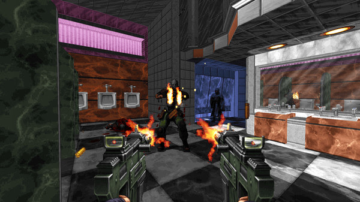
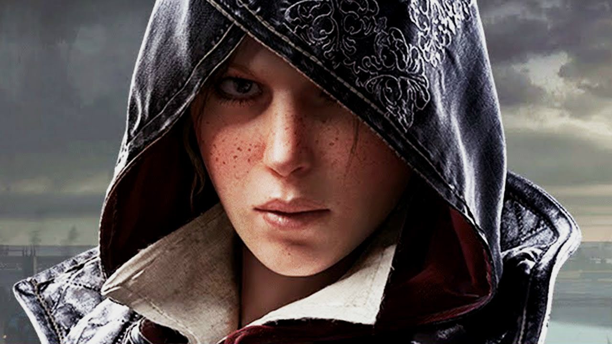
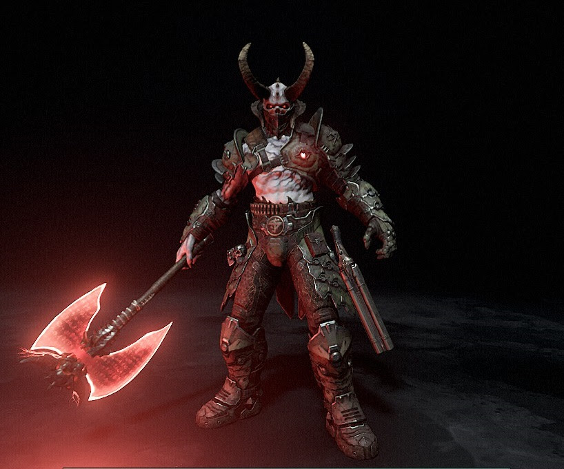
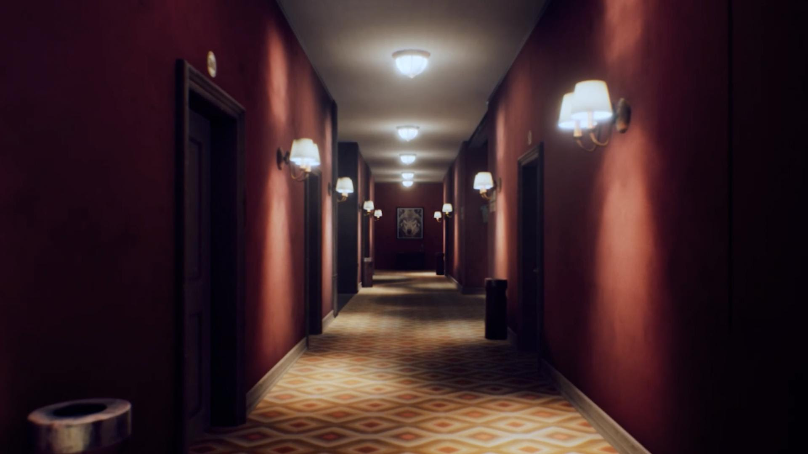
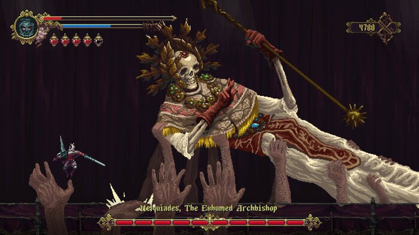
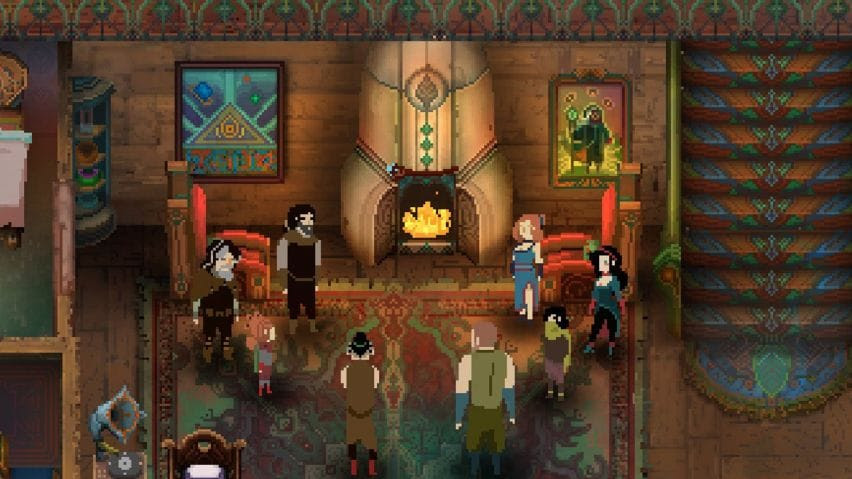
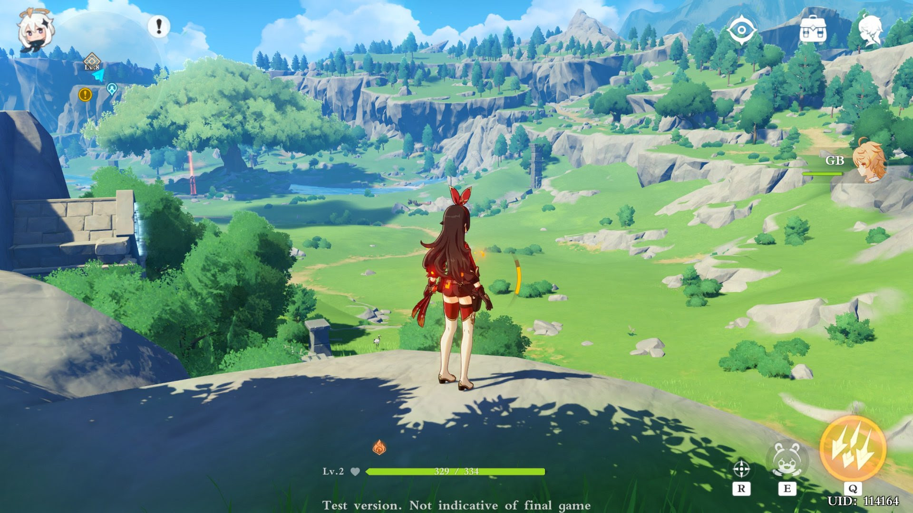
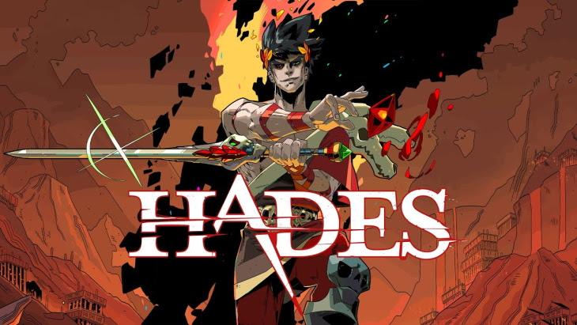

# STEVE'S 2020 GOTY TOP TEN

## 10. Wasteland 3

Beep Beep Motherfucker

Ah, Wasteland, you could have been so much more. The opening hours of this game excited me for the prospect of quality gunplay and an apparently deep itemisation and skill system. Sadly, it all boiled down to finding the least bad available options at any given point, cheesing combat, and basically getting every skill in the group. Made the list because of the fairly decent - or at least fairly enjoyable - writing. And running people over with your tank never gets old. Didn't even finish this in the end, the bugs and load times were just too bad by the final act and I was drawn to other, more stable titsl.

## 8. & 9. Ion Fury/Dusk

  
Occupado

The "what if quake but using modern tech" craze continues. I've grouped these two because they're basically the same game. Frantic, million-mile-per-hour shooters with beefy campaigns and a real challenge on the right difficulties. I know some parts of the industry are tired of this shooter resurgence but honestly give me a campaign over a fucking roguelike any day. Ideal games to just pop into here and there and blast out a few levels.

## 7. Assassin's Creed Syndicate

Evie will fuck you up

An old game that I got a ton of time out of this year! The sense of place is great and the arcadey nature of the combat means its just plain old fun. Ultimately my inability to pass a chest icon without hunting it down doomed this game to incompletion but it was just fucking rad. Also the train base was rad as hell. Like most modern open world games its very CPU intensive and my system struggled a bit with it, or I would have kept going I suspect.

## 6. Doom Eternal

This Fuckin Guy

No game even came close to getting my adrenaline pumping like Doom Eternal in 2020. On ultraviolence the challenge is truly mammoth and there is a headspace you enter where your hands just fucking take over as you swing jump dodge flamethrower in a way that I don't think I've ever experienced. It is honestly a weird state of combat zen that is hard to explain. Would be higher but for the lame platforming and bad end boss who I didn't bother beating. Even the addition of the much-maligned Marauder (decried by critics as ruining the game!) added a twist to the combat I really enjoyed. Remember those clips in the 90s of nerds doing 2 rubiks cubes at the same time really fast while remaining completely calm and expressionless? Doom Eternal is like that but instead of cubes its bloody, flaming chainsaws.

## 5. The Suicide of Rachel Foster

What if Firewatch, but also the Shining?

A really, REALLY good Walking Simulator. Not really much else to say about it. You already know if this kind of game appeals to you. Almost as good as its obvious inspiration, The Remains of Edith Finch. Almost.

## 4. Blasphemous

  
Maybe he's on my side? (Spoilers: He Wasn't)

Side-scrolling souls like. Plays great, controls well, but really it's elevated by its rather spectacular art style and some of the bananas boss designs really steal the show.

## 3. Children of Morta

Between missions, story events unfold in the forest home where our family is based.

This ones a bit of a cheat as I started in December last. A really amazing twin-stick pixelart fantasy game. It's all about family, and also killing monsters. You play as different members of a family who all have their own very unique playstyles. My only complaint is I thought the final boss was a tad too easy.

## 2. Genshin Impact

I still don't know how they made a version of this that runs on fucking mobiles.

Honestly, the only reason this didn't end up at #1 is the scummy gatcha mechanics (which are entirely avoidable). The world is massive and beautiful, the writings really fun (Paimon rules), the combat's alright, and the constant flow of content is hard to ignore. I must be well over a hundred hours now and I'm still putting in an hour or two most days. It is scary how much I've been enjoying this game.

## 1. Hades

Did I mention it's super horny?

Supergiant, creators of Bastion and other similar games, created the perfect roguelike. Dripping in charm, the art is amazing, it feels incredible to play, the writing is next level, and there's even some rad mechanical innovations. This game is so good that I genuinely do not believe it is possible to make a better roguelike.

## Other Awards

### Best Shooter I Couldnt Fit On The List Because There Were Already Too Many Shooters
Project Warlock.
### Best Value No Really This Is Kind of Insane
Game Pass for PC.
### 2020's Game I Put Far Too Much Time Into But Is Too Old to Be On The List
Grim Dawn (250 hours or so)
### Best Anime Game
N/A. All Anime Game's seem to be awful.
### Game I Just Can't Bring Myself To Play Because I Know I'll Bounce Off It, Sorry Dan
C&C Remastered
