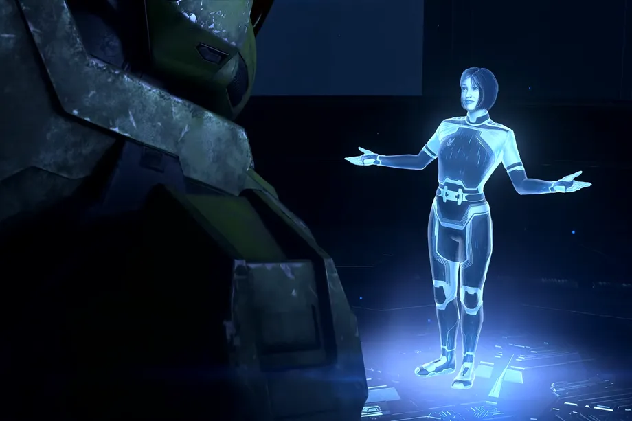
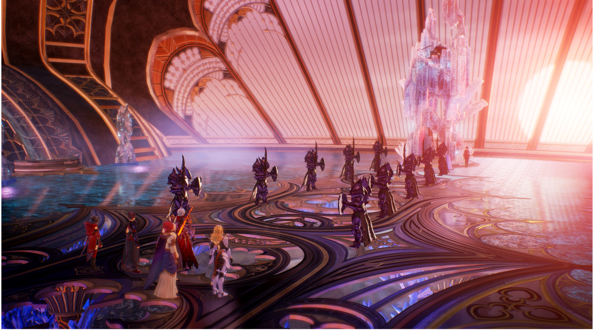
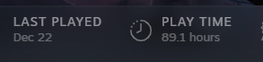
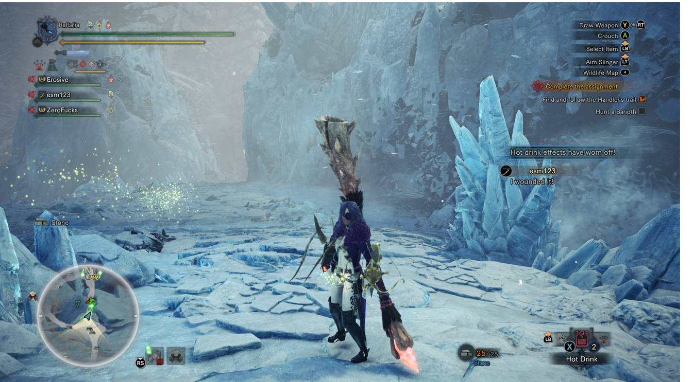
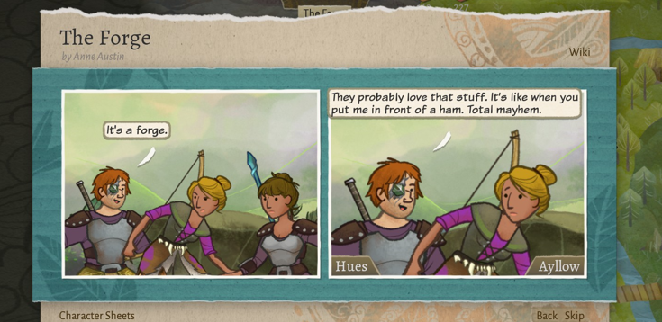
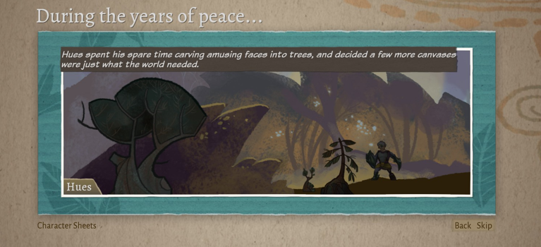
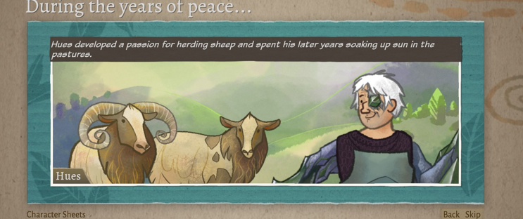
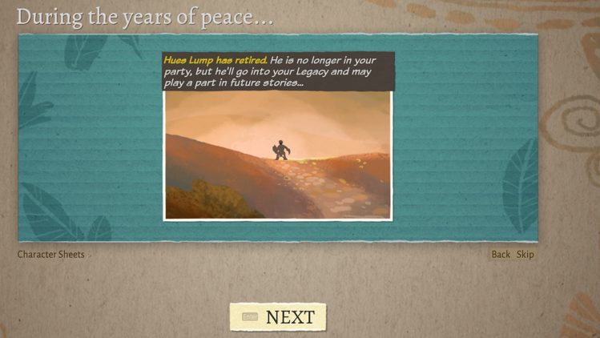
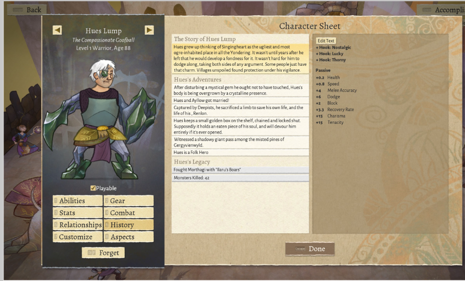

# Steve's 2021 GOTY

It turns out in a pandemic you don't even need an excuse to spend your life playing video games! I played a LOT this year! I finished almost none of them! But a lot of them were good anyway! Like these Ones!

## 10. Slime Rancher

Perhaps the most relaxing game I have ever played. Build an enclosure, go out into the world to abduct slimes, then throw food at them so they make more slimes. Sell surplus slimes for money, use money to build more enclosures and make your tools better, so you can get further in the world, to get more advanced slimes, to get more money, to get more advanced enclosures. I probably put 30 hours into this fucking thing and I didn't even beat it. Highlights for me include returning to my cave to find I had accidentally made every slime there radioactive, and discovering quantum slimes which exist in multiple universes at once and can only be fed with quantum lemons.

## 9. The Ascent

I like a good dual-stick shooter and this one had nice graphics, weirdly great world-building, and an enjoyable (if underdeveloped) layer of rpg mechanics. I don't think I finished it in the end but I enjoyed my time with it. We need more games like this in the world, and considering its origins it was a huge overachiever.

## 8. Astria Ascending

Sometimes, I just want a classic RPG experience. There were several of these this year at that indy gamepass tier, but Astria Ascending was probably the best of the lot. Within the first hour you are introduced to a huge mess of mechanics all over complicated all plopped down on you from nowhere and I spent a good 10 hours figuring out how to master it. Then I spent a bunch more hours trying to break it in satisfying ways. The art in this game is particularly great, lots of hand drawn eastern-style characters - and I really enjoyed untangling the various systems to make characters that worked well together.

## 7. Life is Strange 2

I played through the LiS games this year and 2 was genuinely a touching story with some great twists and turns along the way. It's really well written and has a great tie-in to the first game around the act 4 mark when an unexpected character turns up. It's a throwback to the Trump era and is clearly written by a left-leaning crew who Do Not Like His Policies very much, but there's so many heart warming and human moments along the way that all that stuff is almost secondary.

Major Spoilers (click to see)

In the final act you speed towards trumps wall in your SUV and one ending sees your super powered brother just fucking butcher them all (its kind of amazing and made me want to see a dontnod Heroes game).

## 6. Halo Infinite

Let down by bad boss fights and a weak final act, this game made the list on the strength of the open world and the old 30-seconds-of-fun-rule. It's just so much fun going into different challenges not knowing what to expect - will it be a couple of hunters? or a bunch of snipers? or brutes? or the chargey guys? will their be dropships fucking up your day? will the crew youre rescuing have an OP sniper rifle somewhere? what kind of grenades do you want to use? Maybe you can throw down a shield. Maybe you can take a stealthy approach. What if I grapple hook up there and take that guys rifle and pick them off from way far away? Maybe you should go back and get a tank from the nearest FOB to even the odds.
The sheer combat encounter variety is spectacular and it runs like a dream.

I even liked the cheesey new AI.

## 5. Tales of Arise

Let's get this out of the way up front: This game is visually stunning. And for about 3/4 of it, the combat and story are both very enjoyable too! But then there's a kind of final act/epilogue where the wheels just completely fall off and you're spending all your time in cutscenes. I honestly thought this game would be higher but honestly once I beat it it left sort of a sour taste in my mouth - it's a shame because it's so close to being an all-timer. Scrub the final act, add in a few more cosmetics, and bring back the old hand-drawn Skits (the new in-engine ones dont convey the characters half as well).

## 4. Pathfinder: Kingmaker

The Duke of Pitax is easily the best villain this year.
You have all heard enough from me on this game this year so a picture paints ... etc:

## 3. Monster Hunter: World

I played this game a fuckton (92 hours) and enjoyed almost all my time with it even if it was mostly in early 2021. The controls are a truly obtuse mess. The graphics aren't anything special. The mechanics are often clunky. But somehow it was still super fun and I don't really know why. I randomly picked an insect glaive as my weapon and mastering it took a truly ridiculous amount of time. But once I did, I was firing out my weird magic bees and pole vaulting everywhere. Brilliant. ALso there's a bunch of fucking weird crossover with stuff like the witcher so its trippy as fuck.

## 2. Inscryption

Look I am not a card guy but I loved Inscryption anyway. Then I watched Waypoint doing a playthrough and it made me love it even more. You should get inscryption.

<iframe width="560" height="315" src="https://www.youtube.com/embed/P7bZHHXR_H4" title="YouTube video player" frameborder="0" allow="accelerometer; autoplay; clipboard-write; encrypted-media; gyroscope; picture-in-picture" allowfullscreen></iframe>

## 1. Wildermyth

Wildermyth is incredibly good. Ludicrously good. Wildermyth is the kind of game Bioware would spend $100m creating and make a balls of. The fact that it came from a tiny indy outfit is honestly mindblowing to me still. It looks incredible. The mechanics are incredible. The writing is astounding. It's easy to play, impossible to master. The RNG is a true wild card even in the framework of the 5 main campaigns. Literally everyone who played this game has their own stories to tell but for me, I will never forget Hues Lump. Hues was there on my first adventure - a lovable, friendly cowhand who was away from town when the baddies came. He found himself thrust into action with Alyssa and Ayllow over the years. He was infected by a magical piece of glass from the mines. He never let it get to him though and, at the second-last chapter of the first campaign, he ultimately retired to raise goats in the mountains.

Nobody sat down and hand created Hues Lump. Sure, writers wrote the adventures he embarked on, but not that permutation of them. Never mind the feats I chose for him, the choices I made for him along the way (he fell in love with the farm girl, Ayllow, and ultimately married her on the eve of a massive battle in act 2). There is no flow chart anywhere documenting his character ark. And yet he might be my character of the year - if that's not a little magical, I don't know what is. Hues Lump is the reason Wildermyth beat Inscryption, I will remember him more than Luke Carder from Inscryption - I have more pathos for him than Luke. Luke who was designed and written specifically from the ground up, is less engaging to me than this semi-procedurally-generated character.

Even if you don't want to play WIldermyth I am imploring you to buy it anyway. Here are some of Hues moments:

As it happens, Hues did return in a future adventure which saw the corruption from the glass overtake his body. This Hues was non canonical but still kicked ass.:

While earth-616 Hues story is done, I look forward to his return in future adventures because I will buy the fuck out of whatever this studio does next.
